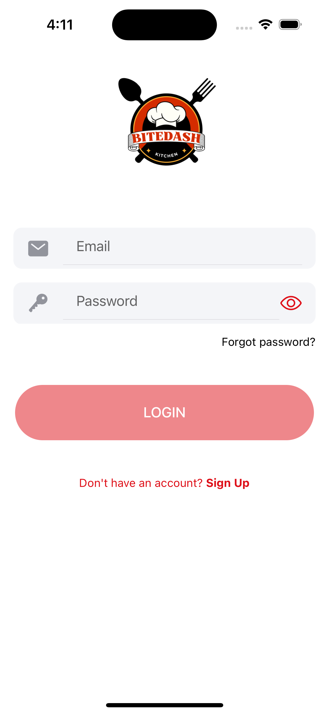
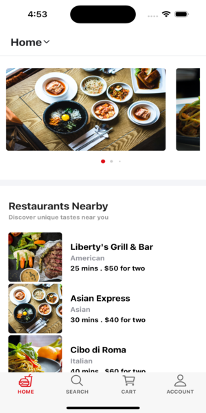
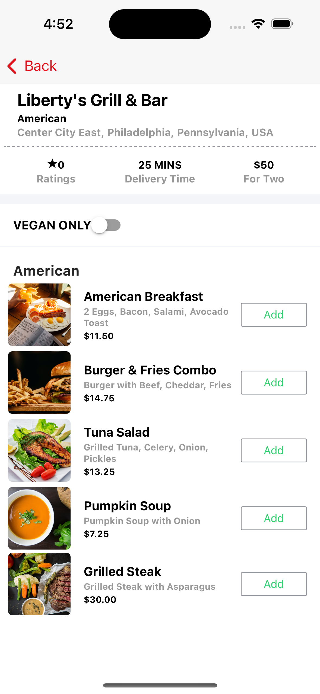
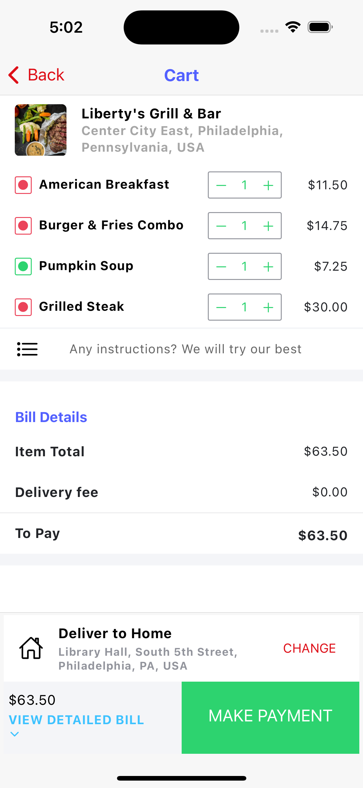
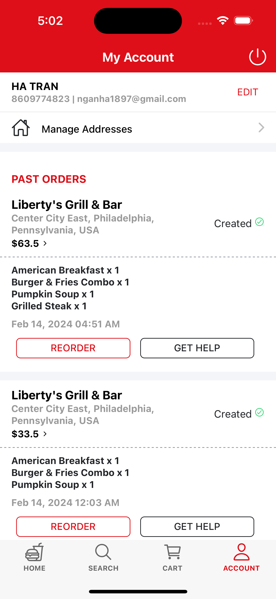
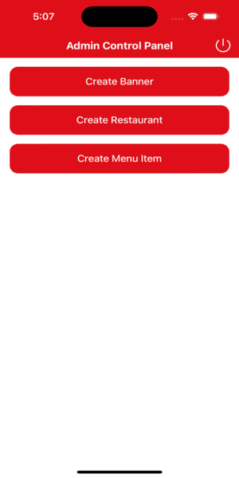

# BiteDash: A food ordering iOS & Android app built with MEAN stack

## Project Overview
This application uses MEAN stack and Ionic framework to build a cross-platform mobile app for food ordering. 

The iOS version can be downloaded at: [https://apps.apple.com/us/app/bitedash/id6477850116]

The backend is deployed to Heroku at: [https://feed-me-app-4038e85fb061.herokuapp.com]

## Technologies
- MongoDB: NoSQL database to store app data
- Express.js: web framework for building RESTful APIs
- Angular: frontend framework (used with Typescript)
- Node.js: application runtime
- Ionic: cross-platform mobile development framework for iOS and Android
- SendGrid: email platform for sending confirmation emails to users. 
- Google Maps API: mat platform for accessing users' location and finding nearby restaurants 
- Cloudinary: platform for storing app's images

## Features

### User Authentication
Users are required to create an account and sign in in order to access the app and place orders. If users forget their password, an email is sent to users' email address with a one-time password (OTP) to reset the password.

### Restaurant & Menu Listings
After authentication, users can view a list of restaurants near their current location in the home tab. Users can click on a restaurant to view its menu and order food. 

             

### Cart Overview
In the cart tab, users can view the list of chosen food items and update the details such as quantity and instructions. Users can specify the delivery address. Currently, payment option is not configured to publish the app to the app stores. When users click payment, orders will automatically go through. 

### Account Overview
In the account tab, users can view and update their account details including addresses. Users can see a list of their successful orders.

### Admin Dashboard
Only admins have access to the admin dashboard, where they can update banners, restaurant, and menu details. 

